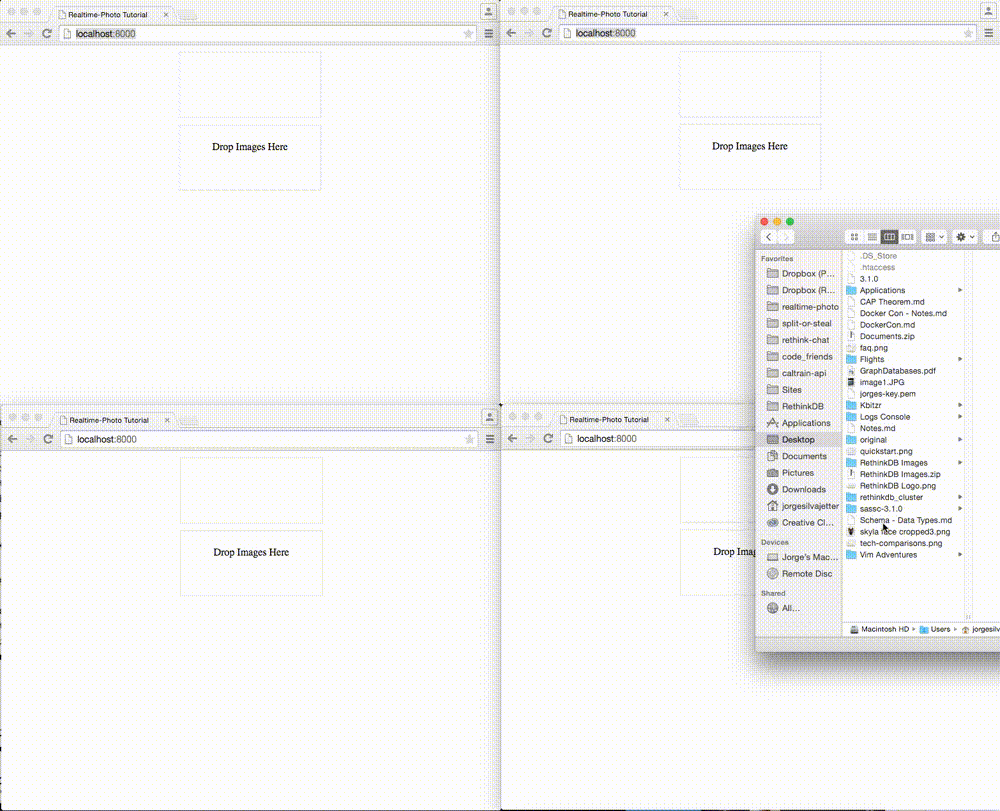

# Realtime Photo Tutorial

A short tutorial on uploading images and broacasting them in realtime using [RethinkDB changefeeds](http://rethinkdb.com/docs/changefeeds/javascript/) and [RethinkDB binary data](http://rethinkdb.com/api/javascript/#binary). If you want to see a more complete, optimized verion of this you can check out the original [realtime photo app](http://realtime-photo.thejsj.com) or check out [the repo in GitHub](https://github.com/thejsj/realtime-photo).



## Setup

After installing [RethinkDB](rethinkdb.com/docs/install/) and Node.js, install all packages with npm:

```
npm install
```

After that, run the server:

```
node server/index.js
```

Finally, go to `http://localhost:8000` and try it out!
